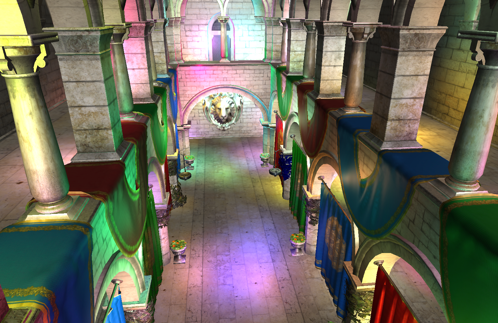

# Cute Deferred Shading Implementation



This is a cute little implementation of normal deferred shading. The
focus of this implementation was readability and brevity, so that
others can learn from the code. The entire renderer is only about 1400
lines of C++ code. Note that there are probably ways in which the
implementation can be made faster, but such optimizations were not
performed to keep things brief, and readable.

The number of external dependencies has been intentionally kept
low. The only dependencies are GLFW, a PNG loader(LodePNG) and an
obj-file loader(tinyobjloader). This makes the implementation more
self contained.

The entire implementation can be found in the file
`src/main.cpp`. There are no other files.

# Awesome Video

[](https://www.youtube.com/watch?v=vB2svwmjGUg)

## Building and Running

The project uses CMake, and all dependencies are included, so you
should use CMake to generate a "Visual Studio Solution"/makefile,
and then use that to compile the program.

The compiled program takes a single command line argument: the
directory in which the Cryktek Sponza obj-file can be located. In
order to run, you should download Crytek Sponza from
[here](http://graphics.cs.williams.edu/data/meshes.xml), unpack, and
then run the program as

```
deferred_shading sponza/
```

where `sponza/` is the unpacked directory.

## Camera Controls

Camera controls for the demo: `w` and `s` to walk forward and
backward. `a` and `d` to stride. `o` and `l` to fly. Hold in `m` to go
faster. Use the mouse to rotate the camera.
